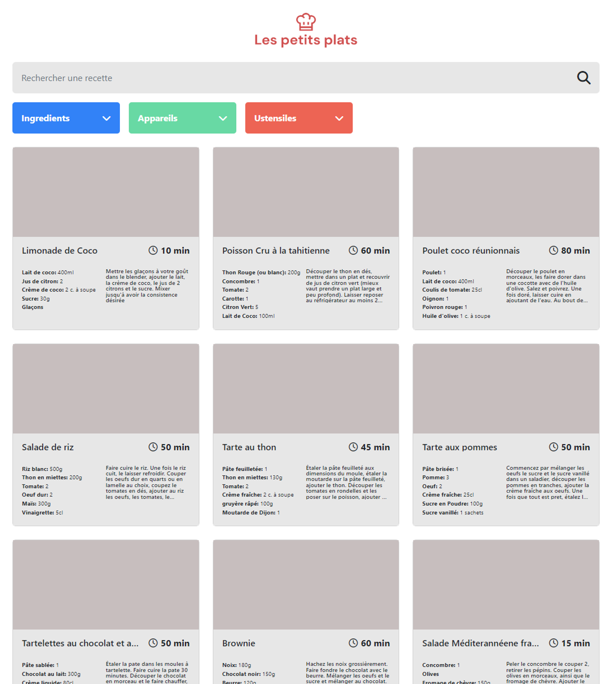

  

<h1 align="center" style="margin-top: 0px;">Projet 7</h1>

## Scénario :

## Cahier des charges :
- La recherche doit pouvoir se faire via le champ principal ou via les tags (ingrédients, ustensiles ou appareil).
- La recherche principale se lance à partir de 3 caractères entrés par l’utilisateur dans la barre de recherche.
- La recherche s’actualise pour chaque nouveau caractère entré.
- La recherche principale affiche les premiers résultats le plus rapidement possible.
- Les champs ingrédients, ustensiles et appareil de la recherche avancée proposent seulement les éléments restant dans les recettes présentes sur la page.
- Les retours de recherche doivent être une intersection des résultats. Si l’on ajoute les tags “coco” et “chocolat” dans les ingrédients, on doit récupérer les recettes qui ont à la fois de la coco et du chocolat.
- Comme pour le reste du site, le code HTML et CSS pour l’interface (avec ou sans Bootstrap) devra passer avec succès le validateur W3C.
- Aucune librairie ne sera utilisée pour le JavaScript du moteur de recherche.